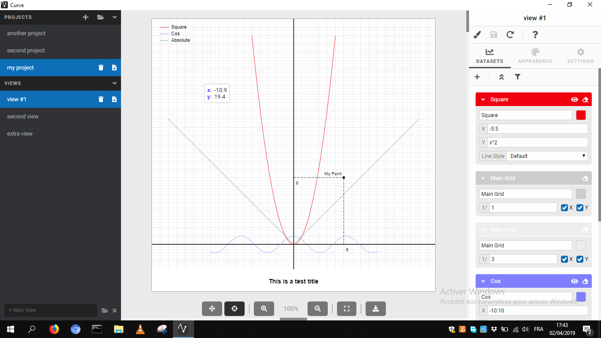
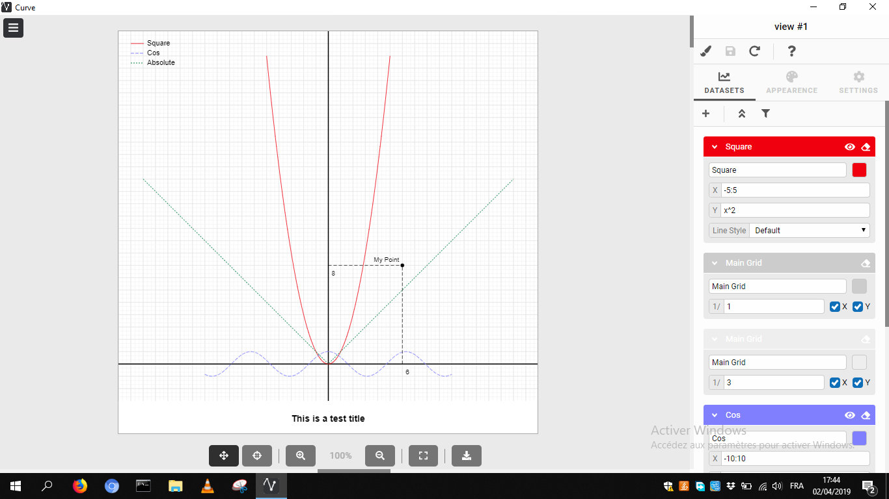
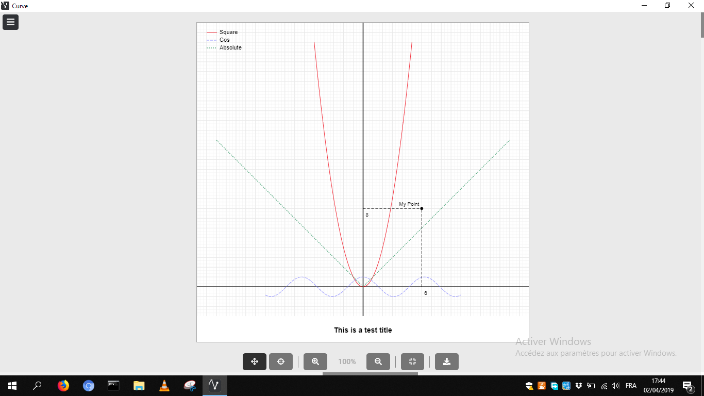
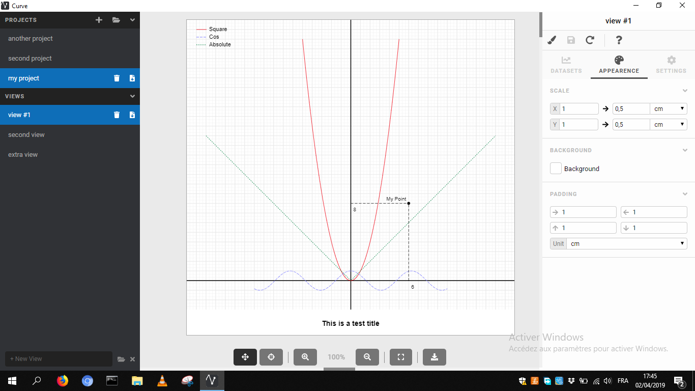
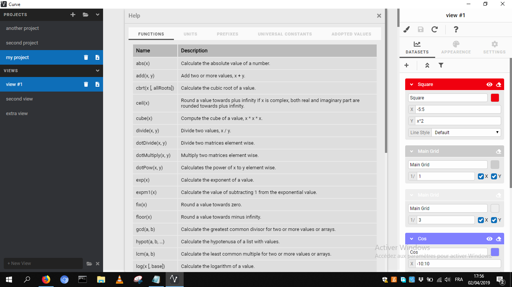

# Curve
**Angular** & **Electron** desktop app that helps you draw/visualize datasets (curves, point marks, grids).
* You can write functions in plain form like '2*cos(x)/abs(x)'.
* It's shipped with a help modal that shows predefined functions, units, and constants (see screenshots).
* Curve works by creating projects, every project has multiple views, It gives the ability to import/export projects and views using external files (.project.crv, .view.crv).

## Notes
#### Create New Dataset
- Create a new placeholder in `services/placeholders.ts`.
- Register the type in the database by adding it to `services/dataset.service.ts`. 
- Create a form in `dataset-control` component.